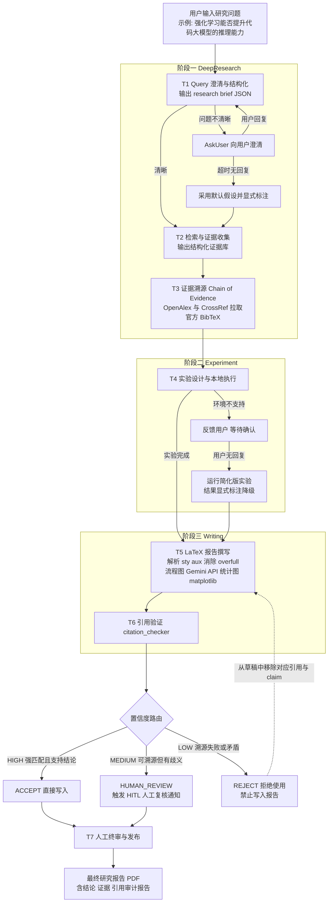

# AI Research Agent 设计文档:基于证据链溯源与置信度路由的自动化研究报告系统

> 用户输入一个研究问题,Agent 自动完成澄清、深度检索、实验验证与报告撰写,
> 输出一份包含**主要结论、支持证据、引用来源**的研究报告。
> 全文以示例问题贯穿:**"强化学习是否能够提升代码大模型的推理能力?"**

---

## 0. 总体架构

系统采用**三段式 pipeline**:**DeepResearch(深度检索)→ Experiment(实验验证)→ Writing(报告撰写)**,并由两条贯穿全程的机制保证可信性:

1. **Chain of Evidence(证据链)引用溯源**:任何进入报告的引用,都必须能沿
   `正文 claim → 证据库条目 → OpenAlex/CrossRef 官方元数据 → 官方 BibTeX` 这条链完整回溯。
   **严禁 LLM zero-shot 直接生成 BibTeX**;OpenAlex 与 CrossRef 双向均查不到的文献一律禁止引用。
2. **置信度路由 + HITL(Human-in-the-Loop)**:每条引用与关键结论都被判为
   HIGH / MEDIUM / LOW 三档——高置信直接写入,中置信触发人工复核通知,低置信拒绝使用且禁止写入(详见第 3 节)。

以示例问题走一遍全流程:

- **DeepResearch**:用户问"强化学习是否能够提升代码大模型的推理能力?"——问题缺少 baseline 与评测指标,Agent 先向用户澄清("对比对象是 SFT-only 模型吗?指标用 HumanEval/LiveCodeBench pass@1 吗?");若用户超时未回复,Agent 采用**显式标注的默认假设**(baseline = 同底座 SFT 模型,metric = pass@1),组织成结构化 research brief,再执行 query-based deep research,产出结构化证据库(每条 claim 附 URL/DOI/原文摘录/检索时间)。
- **Experiment**:设计一个可在本地复现的小规模验证实验(如在小型代码模型上跑 RLVR 微调前后的 pass@1 对比,或复算公开榜单数据);本地环境不支持(无 GPU 等)时先反馈用户,用户不回复则运行**标注过降级的简化版本**。
- **Writing**:按用户提供的 LaTeX 模版撰写报告,解析 `.sty`/`.aux` 获取物理尺寸消除 overfull hbox;流程图用用户提供的 Gemini API + Paper Banana 生成,统计图用 Python(matplotlib)生成;随后 `citation_checker` 对每条引用做溯源与支持性判定,按置信度路由,最后由人工终审签发。

架构要点:

- **结构化中间产物**:每个阶段的输出都是带 JSON Schema 的结构化数据(research brief、证据库、bibliography、实验结果、审计报告),下游任务只消费结构化数据,不消费自由文本,便于测试与审计。
- **失败即降级、降级必标注**:任何降级路径(默认假设、简化实验)都必须在产物中显式标注,不允许静默降级。
- **人是终点**:pipeline 的出口不是"生成 PDF",而是"人工终审签发"(见第 2 节决策边界)。

---

## 1. 任务拆解

Pipeline 被拆解为 7 个原子任务(T1–T7),每个任务定义清晰的输入/输出契约与失败降级策略。

### T1 Query 澄清与结构化

- **所属阶段**:DeepResearch
- **输入**:用户原始研究问题(自由文本),如"强化学习是否能够提升代码大模型的推理能力?"
- **输出**:结构化 research brief(JSON,符合 schema),包含:研究问题(可检验的表述)、研究范围(scope,时间窗/模型类别)、baseline(如同底座 SFT-only 模型)、metrics(如 HumanEval / LiveCodeBench pass@1)、关键词与检索式(如 `RLHF / RLVR / code LLM / reasoning`)、以及"哪些字段来自用户确认、哪些来自默认假设"的来源标注。
- **失败与降级策略**:问题不清晰(缺 baseline、缺指标、scope 模糊)时先 **AskUser** 向用户澄清;用户超时未回复,则 Agent 自行组织 query,补全 baseline/metrics 等字段,但每个补全字段必须打 `assumed: true` 标记并在最终报告中显式声明"本假设未经用户确认"。scope 的最终确认权始终属于用户(见第 2 节)。

### T2 Deep Research 检索与证据收集

- **所属阶段**:DeepResearch
- **输入**:T1 输出的 research brief。
- **输出**:结构化证据库(evidence base,JSON)。每条证据(claim)必须附:来源 URL 和/或 DOI、原文摘录(verbatim quote)、检索时间戳、与研究问题的关联说明。示例:claim "RL 微调在竞赛编程任务上显著提升 pass@1" ← 附 DeepSeek-R1 论文 DOI、摘录段落、检索时间。
- **失败与降级策略**:某一子 query 检索为空时,改写检索式重试(同义词扩展、放宽时间窗);仍为空则在证据库中记录 `no_evidence_found`,该方向的结论在报告中只能以"未找到公开证据"表述,**禁止**用模型内部知识补一条"看起来像证据"的记录。网络故障时任务失败并重试,绝不将失败静默当作"无相关文献"。

### T3 证据溯源与 BibTeX 生成(Chain of Evidence)

- **所属阶段**:DeepResearch(产物贯穿后续所有阶段)
- **输入**:T2 输出的证据库。
- **输出**:带匹配置信度的 bibliography(JSON + `.bib`)。每条 bib 项包含:官方 BibTeX(从 OpenAlex/CrossRef pull 回)、匹配方式(DOI 精确命中 / 标题模糊匹配)、标题相似度分数、作者与年份核对结果、溯源链完整记录。
- **失败与降级策略**:以证据库为 base,先按 DOI 查 OpenAlex,miss 则查 CrossRef,再 miss 则按标题模糊匹配(归一化后编辑距离/相似度打分)。**两个数据源双向都查不到的引用,一律禁止引用**——对应 claim 被降级或删除,绝不允许 LLM zero-shot 编造 BibTeX 兜底。模糊匹配存在歧义(多个候选相似度接近)时不自行拍板,标记 MEDIUM 进入 HITL(见第 3 节)。

### T4 实验设计与本地执行

- **所属阶段**:Experiment
- **输入**:research brief + 证据库(用于确定实验假设与对照),输出一份**可复现实验方案**(依赖清单、数据、脚本、预期运行时长)后执行。
- **输出**:实验结果 JSON(指标数值、随机种子、环境快照)+ 统计图(matplotlib 生成的 PNG/PDF)。示例:小型代码模型 RL 微调前后在抽样测试集上的 pass@1 对比表与柱状图。
- **失败与降级策略**:默认在本地执行;执行前先探测环境(GPU、内存、依赖),**环境不支持时先反馈用户**(说明缺什么、完整实验需要什么资源);用户在时限内不回复,则运行**简化版本**(更小模型/子采样数据/更少 seed),且实验结果 JSON 与报告中必须带 `degraded: true` 及降级说明,图表标题追加"(简化实验)"字样。简化版仍失败则报告只呈现文献证据,实验章节明确写"本地验证未能完成"。

### T5 报告撰写(Writing)

- **所属阶段**:Writing
- **输入**:证据库 + bibliography + 实验结果 JSON/图 + 用户提供的 LaTeX 模版(`.tex`/`.sty`/`.cls`)。
- **输出**:LaTeX 源码与编译后的 PDF 草稿,含主要结论、支持证据、引用来源三要素;流程图由用户提供的 Gemini API + Paper Banana 生成,统计图由 Python(matplotlib)生成。
- **失败与降级策略**:排版上解析 `.sty` 与编译产生的 `.aux`/`.log` 获取物理尺寸(`\textwidth`、`\columnwidth` 等),按真实列宽生成图表与表格,迭代编译直至消除 overfull hbox 等告警;无法消除的告警列入交付说明。Gemini API 不可用时降级为 TikZ/mermaid 绘制流程图并标注降级。正文中**每一次引用**都必须来自 T3 的 bibliography——写作模块没有新建引用的权限。

### T6 引用验证与置信度路由

- **所属阶段**:Writing(质量门,gate)
- **输入**:T5 的报告草稿 + bibliography + 证据库。
- **输出**:引用审计报告(JSON):对草稿中每个 `\cite` 逐条给出 (1) 溯源核验结果(重放 Chain of Evidence);(2) **claim–evidence 支持性判定**(该引用是否真的支持它所在句子的论断:支持/不支持/证据不足);(3) 置信度档位与路由动作(HIGH→写入、MEDIUM→HITL 通知、LOW→拒绝)。
- **失败与降级策略**:由确定性的 `citation_checker` 执行,不依赖生成模型的自由发挥。任何 LOW 档引用直接从草稿移除并回灌 T5 重写对应句子;**引用列表为空时测试与流水线直接报错失败**(一份研究报告不允许零引用);外部 API 故障时判定结果为 `UNVERIFIED` 而非 `ACCEPT`,流水线阻塞等待重试。

### T7 人工终审与发布(HITL)

- **所属阶段**:Writing(出口)
- **输入**:报告 PDF + 引用审计报告 + 全部 MEDIUM 档 HITL 复核项 + 降级标注清单。
- **输出**:人工签发的最终报告(或退回修改意见)。
- **失败与降级策略**:此环节**不允许降级、不允许跳过**——存在未处理的 MEDIUM 复核项或未确认的降级标注时,报告不得发布。人工可以:批准、退回指定任务重跑(如要求 T2 补检索)、或否决结论。

### 任务输入/输出汇总表

| 任务 | 阶段 | 输入 | 输出 | 失败/降级要点 |
|---|---|---|---|---|
| T1 Query 澄清与结构化 | DeepResearch | 用户原始问题 | research brief(JSON:问题/scope/baseline/metrics/关键词) | 不清晰→AskUser;超时→显式标注的默认假设 |
| T2 检索与证据收集 | DeepResearch | research brief | 结构化证据库(claim+URL/DOI+摘录+检索时间) | 检索为空→改写重试;仍空→记 no_evidence,禁止编造 |
| T3 证据溯源与 BibTeX | DeepResearch | 证据库 | 带匹配置信度的 bibliography(官方 BibTeX) | 双源均 miss→禁止引用;歧义→HITL;禁止 zero-shot bib |
| T4 实验设计与执行 | Experiment | brief+证据库→可复现实验方案 | 实验结果 JSON + 统计图 | 环境不支持→反馈用户;无回复→跑标注降级的简化版 |
| T5 报告撰写 | Writing | 证据库+bibliography+实验结果+LaTeX 模版 | LaTeX 源码 + PDF 草稿 | 解析 sty/aux 消 overfull;Gemini 不可用→TikZ 降级 |
| T6 引用验证与路由 | Writing | 报告草稿+bibliography+证据库 | 引用审计报告 + HIGH/MEDIUM/LOW 路由 | 引用列表为空→报错;API 故障→UNVERIFIED 非 ACCEPT |
| T7 人工终审与发布 | Writing | PDF+审计报告+HITL 项+降级清单 | 签发的最终报告 / 退回意见 | 不允许降级或跳过 |

---

## 2. 决策边界:哪些步骤不能完全交给 AI

以下环节保留人工决策权。判断标准是四个维度:**不可逆性**(错误能否撤回)、**责任归属**(出错谁承担)、**AI 校验能力边界**(AI 能否可靠地自我核验)、**错误代价不对称**(多问一句的成本 vs 猜错的成本)。

### (a) 研究意图与 scope 的最终确认 —— 必须由用户拍板

研究意图只存在于用户脑中,不在任何可检索的语料里,AI 对意图的"推断"本质上是猜测。示例问题里,"推理能力"可以指竞赛编程正确率、多步规划、也可以指测试时扩展的 CoT 质量——三种理解会导向三份完全不同的报告。**代价不对称**:向用户多问一轮澄清的成本是分钟级,而按猜错的 scope 跑完整条 pipeline 的成本是小时级的算力与全部返工。因此 T1 中 AI 只能提出候选解释与默认假设,scope 的最终确认权在用户;超时采用的默认假设也必须显式标注、可被随时推翻。

### (b) 歧义证据的取舍与冲突结论的仲裁 —— 必须人工复核

当多篇文献结论冲突(如"RL 只是放大了 base model 已有能力"vs"RL 带来新能力"),或模糊匹配出多个相近候选文献时,AI 做仲裁面临双重风险:**幻觉风险**——LLM 在证据不足时倾向生成看似合理的调和性结论,而非承认不确定;**责任归属**——报告采信了哪一方,是一个日后要向读者负责的学术判断,不能追责到模型。这正是置信度路由中 MEDIUM 档强制触发 HITL 的原因:AI 负责把歧义**呈现清楚**(两边证据、匹配分数、冲突点),裁决权交给人。

### (c) 实验环境不可用时的降级批准 —— 属于资源/成本决策

跑完整实验还是跑简化版,不是技术问题而是**资源与成本决策**:用户可能宁可花钱租 GPU 也要完整结果,也可能只需要方向性结论。AI 无法知道用户的预算约束与结果用途,替用户默认"简化就够了"是越权。因此 T4 的协议是:先反馈、等待用户批准;只有在用户明确不回复的兜底场景下才自动跑简化版,且降级必须显式标注——标注本身就是把"是否接受这个降级"的最终决定延迟交还给了 T7 的人工终审。

### (d) 最终报告的签发与结论定稿 —— 学术责任不可外包

报告一旦发布就进入引用与传播链条,**不可逆**;错误引用或失实结论构成学术不端,承担后果的是署名的人而不是模型——**学术责任无法外包给 AI**。同时这是 AI 校验能力的边界:citation_checker 能验证"引用可溯源、字面上支持论断",但"这个结论的强度是否与证据相称、是否遗漏了重要反例"需要领域判断。因此 T7 人工终审是 pipeline 的硬性出口,任何自动化档位(包括全部 HIGH)都不能替代签发动作。

### (e) 伦理、合规与未发表数据的判断 —— 必须人工把关

涉及未公开数据集/私有代码库的使用许可、他人未发表工作(预印本的引用礼仪、双盲评审材料)、许可证与数据合规、潜在双重用途结论的披露方式等,判断依据往往是合同、机构政策与学术共同体规范——这些不完整地存在于模型训练数据里,且**错误代价极端不对称**(一次违规可能导致法律后果或声誉损失,且不可逆)。AI 的职责是**识别并拦截**这类信号(如证据来源标记为 under review、数据集许可证为 non-commercial)并升级给人,而不是自行放行。

---

## 3. 置信度路由(HIGH / MEDIUM / LOW 三档)

每条引用在 T6 由 `citation_checker` 依据 Chain of Evidence 的溯源结果 + claim–evidence 支持性判定,路由到三档之一:

| 档位 | 判定条件(全部满足/任一满足) | 动作 | 示例(基于示例问题) |
|---|---|---|---|
| **HIGH / ACCEPT** | **全部满足**:(1) 有完整 Chain of Evidence 溯源链;(2) 强匹配——DOI 在 OpenAlex 或 CrossRef 精确命中,**或** 标题归一化相似度 ≥ 0.95 且第一作者姓氏一致且发表年份一致;(3) BibTeX 为官方 pull 回,非生成;(4) claim–evidence 支持性判定为**支持**(原文摘录直接支撑正文论断)。 | **直接写入**报告,审计报告记录溯源链。 | 正文写"RLVR 训练显著提升竞赛编程 pass@1",引用 DeepSeek-R1:DOI 精确命中 OpenAlex,官方 BibTeX,论文摘要与实验章节直接支持该论断。 |
| **MEDIUM / HUMAN_REVIEW** | 可溯源(至少一个数据源查得到),但**任一**成立:(1) 仅模糊匹配命中(0.85 ≤ 相似度 < 0.95,或标题匹配但年份差 1、作者拼写有出入);(2) 多个候选文献相似度接近,无法唯一确定;(3) 支持性判定为**弱支持/间接支持**(证据只支持论断的弱化版本);(4) 多源信息冲突(OpenAlex 与 CrossRef 元数据不一致,或多篇文献结论互相矛盾)。 | **触发 HITL 人工复核通知**:暂挂该引用,推送复核卡片(候选列表、匹配分数、原文摘录、冲突点),由人批准、替换或删除。**未复核完毕不得发布**。 | "RL 只是提升采样效率而非推理上限"——检索到结论相反的两篇论文;或某 arXiv 预印本标题模糊匹配到两个版本(会议版/预印本),相似度 0.91/0.89,需人工选定。 |
| **LOW / REJECT** | **任一**成立:(1) 溯源失败——OpenAlex 与 CrossRef 双向均查不到;(2) 元数据矛盾——作者/年份/venue 与证据库记录对不上,疑似张冠李戴;(3) 摘要/原文与正文论断**矛盾**(支持性判定为不支持或相反);(4) 引用不来自 T3 bibliography(即来路不明,疑似模型生成)。 | **拒绝使用,禁止写入**:引用与对应 claim 一并从草稿移除,回灌 T5 重写;审计报告记录拒绝原因。**绝不允许"降级改写后再用"**(不许把论断改弱来迁就一条不合格引用)。 | LLM 草稿中出现一条格式完美但两库均查无此文的 bib(典型幻觉引用);或引用的论文摘要实际结论是"RL 未带来 base model 之外的新推理能力",与正文"RL 显著提升推理上限"直接矛盾。 |

三条硬性规则(优先级高于任何生成质量考量):

1. **无 Chain of Evidence 溯源的数据一律不许写入**——包括引用、数值、图表数据点;写作模块没有新建证据的权限。
2. **可溯源但有歧义的必须触发 HITL 通知**——MEDIUM 不是"择优自动选一个",AI 无仲裁权。
3. **REJECT 是终态**——被拒引用不得通过改写正文、弱化论断、换个位置引用等方式"洗白"复活;若该 claim 确实重要,唯一出路是回到 T2 重新检索到合格证据。

---

## 4. 测试策略概览

测试目标:证明**引用验证与置信度路由在对抗性输入下仍然正确**,而非仅在理想路径上工作。所有外部依赖(OpenAlex/CrossRef/网页抓取)在测试中通过 **mock 注入 fetch 层**替换——录制固定响应回放,保证测试离线可运行、结果可复现,不受 API 波动影响。

### 三个必测场景(对应面试题第 6 问)

| 场景 | 构造 | 期望行为 |
|---|---|---|
| S1 引用真实且支持结论 | mock 返回 DOI 精确命中的官方元数据,摘录支持正文论断 | 判 HIGH/ACCEPT,写入报告,审计报告含完整溯源链 |
| S2 引用真实但**不支持**结论 | mock 返回真实元数据,但摘要结论与正文论断相反 | 判 LOW/REJECT,禁止写入;**绝不因"文献是真的"而放行** |
| S3 引用或论文**不存在** | 幻觉 bib:格式合法但 OpenAlex 与 CrossRef 双查均 miss | 判 LOW/REJECT,claim 一并移除;禁止 zero-shot 生成 bib 兜底 |

### 边界用例

- **引用列表为空必须报错**:整份报告 `\cite` 数为 0 或 `.bib` 为空时,测试断言流水线以非零状态失败——研究报告零引用即无效交付。
- **网络故障禁止误判为 ACCEPT**:mock 注入超时/5xx/连接拒绝,断言结果为 `UNVERIFIED` 且流水线阻塞重试;"查不到"与"查询失败"必须是两种不同状态,后者绝不能落入任何放行路径。
- **模糊匹配歧义必须进 HITL**:mock 返回两个相似度接近(如 0.91 vs 0.89)的候选,断言路由为 MEDIUM 且生成人工复核通知,而非自动择优。
- **降级标注不可丢失**:简化实验(`degraded: true`)与默认假设(`assumed: true`)的标注必须出现在最终报告文本中,测试对 PDF 文本做断言。

### 端到端:基于 PDF 输入的引用溯源审计(`pdf_citation_audit.py`)

以一份编译产出(或外部输入)的 PDF 为起点做黑盒审计:抽取正文中的引用标记与参考文献表,逐条重放 Chain of Evidence(查 OpenAlex/CrossRef、核对元数据、抽取对应正文句做支持性判定),输出与 T6 相同 schema 的审计报告。它同时充当:(1) 端到端回归测试——对本系统产出的 PDF,断言审计结果与流水线内 T6 结论一致;(2) 独立审计工具——可用于审计任意第三方论文 PDF 的引用质量。测试语料包含一份人工植入缺陷(1 条幻觉引用 + 1 条不支持结论的真实引用)的 PDF,断言两处均被检出。

### 分层结构

- **单元测试**:匹配打分函数(相似度阈值边界 0.95/0.85 两侧)、BibTeX 字段核对、路由决策表的穷举覆盖。
- **集成测试**:T3+T6 在 mock fetch 层上的全路径(命中/模糊/miss/故障)。
- **端到端测试**:示例问题走通 T1–T7(实验用最小化 stub),加上 `pdf_citation_audit.py` 黑盒审计。

---

*本文档为设计交付物;实现与测试代码位于同目录 `ai-research-agent/` 下。*
